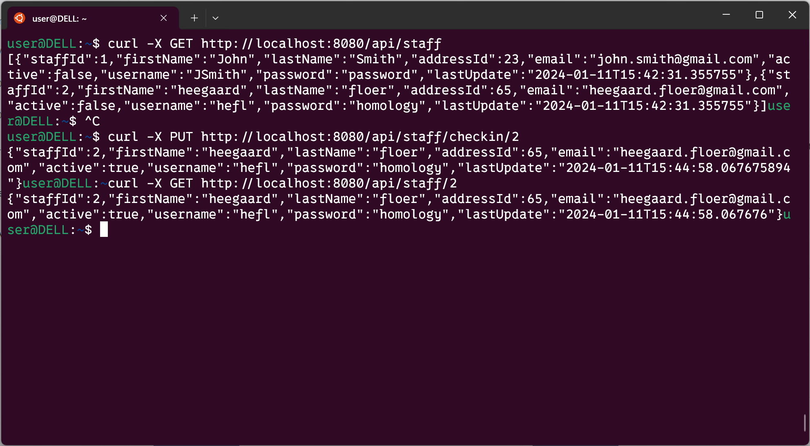

# Dummy Project for Docker Exercise

This is a dummy project for my personal exercise. I will try to fill in more meaningful functionalities when I have time.


## How to run it

 Go to `./src/main/docker` and start the application using Docker Compose:

```
docker-compose up
```

Once the containers are up and running, you should be able to send HTTP requests to `localhost:8080`.


